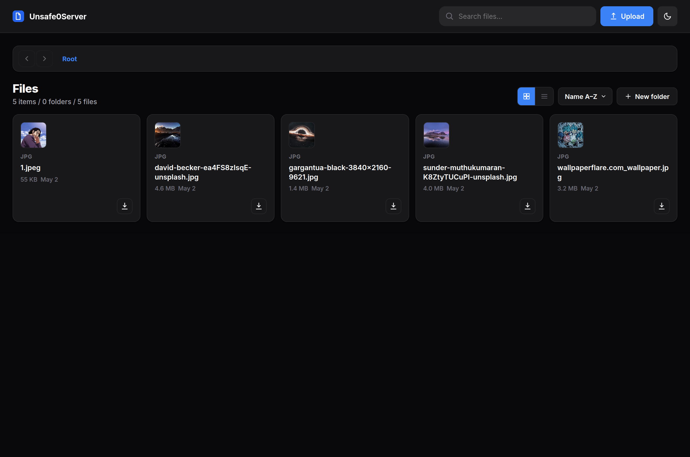
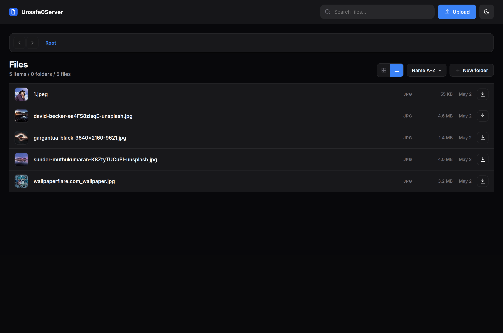
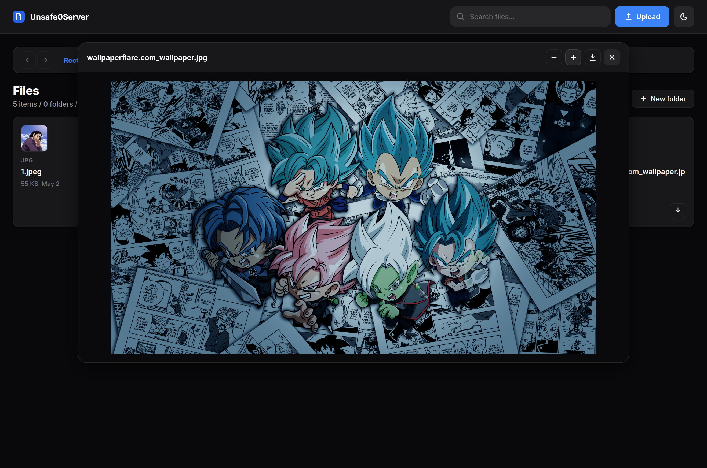

# Unsafe0Server

A minimal, self-hosted file server with a modern web-based file manager UI. Built with Go and vanilla JS/CSS.

## Preview

| Grid View | List View |
|:-:|:-:|
|  |  |

| File Preview |
|:-:|
|  |

## Features

- **Authentication** — Secure login with configurable credentials via `.env`
- **File Management** — Browse, upload, download, rename, and delete files
- **Folder Operations** — Create and navigate nested directories
- **Preview** — Built-in viewer for images, videos, PDFs, and text files with zoom controls
- **Drag & Drop** — Drop files directly into the browser to upload
- **Keyboard Shortcuts** — `Escape` to close, `Delete` to remove selected items
- **Multi-select** — Click, Shift-click, Ctrl-click, or drag-select multiple files
- **Search** — Filter files in the current directory
- **Sort** — By name, date, or size
- **Themes** — Light and dark mode with system persistence
- **Grid / List** — Toggle between card grid and compact list views

## Setup

1. Copy the `.env.example` file to `.env` (or create one) and set your credentials:
   ```env
   APP_USERNAME=admin
   APP_PASSWORD=mysecurepassword
   APP_ROOT_DIR=./data
   ```

2. Run the application:
   ```bash
   go run main.go

   # or build and run
   go build -o home-server
   ./home-server
   ```

## Options

| Flag | Description | Default |
|------|-------------|---------|
| `-root` | Root directory to serve | `APP_ROOT_DIR` or `./data` |
| `-addr` | Listen address | `:8080` |
| `-username` | Login username | `APP_USERNAME` or `admin` |
| `-password` | Login password | `APP_PASSWORD` or `welcome123` |

Open [http://localhost:8080](http://localhost:8080) in your browser to access the server.

## Installation (System-wide)

To access the server from anywhere using the `home-server` command:

1. Build the binary:
   ```bash
   go build -o home-server
   ```

2. Move it to your local bin directory:
   ```bash
   sudo mv home-server /usr/local/bin/
   ```

Now you can run `home-server -root /path/to/data` from any terminal.

## Auto-start on Boot (systemd)

To make the server start automatically when your system boots:

1. Create a service file:
   ```bash
   sudo nano /etc/systemd/system/home-server.service
   ```

2. Paste the following configuration (replace `yourusername` with your actual Linux username and adjust paths):
   ```ini
   [Unit]
   Description=Home File Server
   After=network.target

   [Service]
   Type=simple
   User=yourusername
   WorkingDirectory=/home/yourusername/Documents/home-server
   ExecStart=/usr/local/bin/home-server -root /home/yourusername/Documents/home-server/data -addr :8080
   Restart=always

   [Install]
   WantedBy=multi-user.target
   ```

3. Enable and start the service:
   ```bash
   sudo systemctl daemon-reload
   sudo systemctl enable home-server
   sudo systemctl start home-server
   ```

Check status with `sudo systemctl status home-server`.

## License

This project is licensed under the MIT License - see the [LICENSE](LICENSE) file for details.